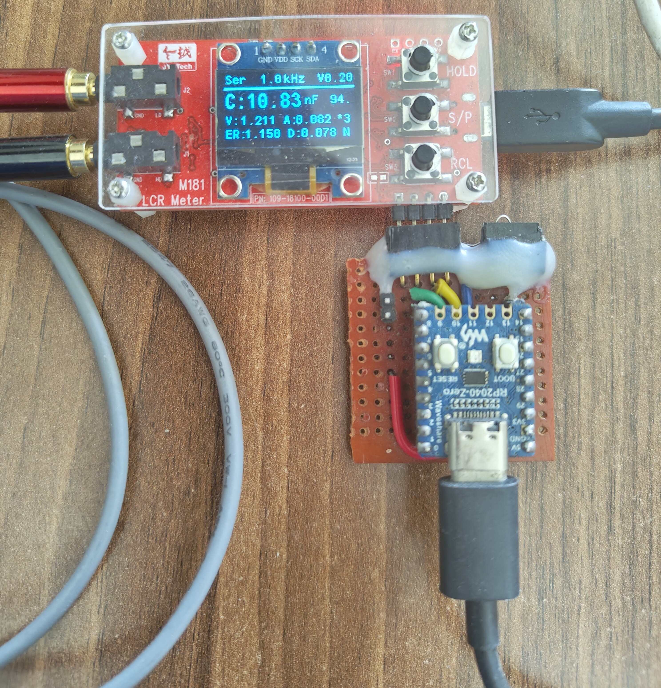
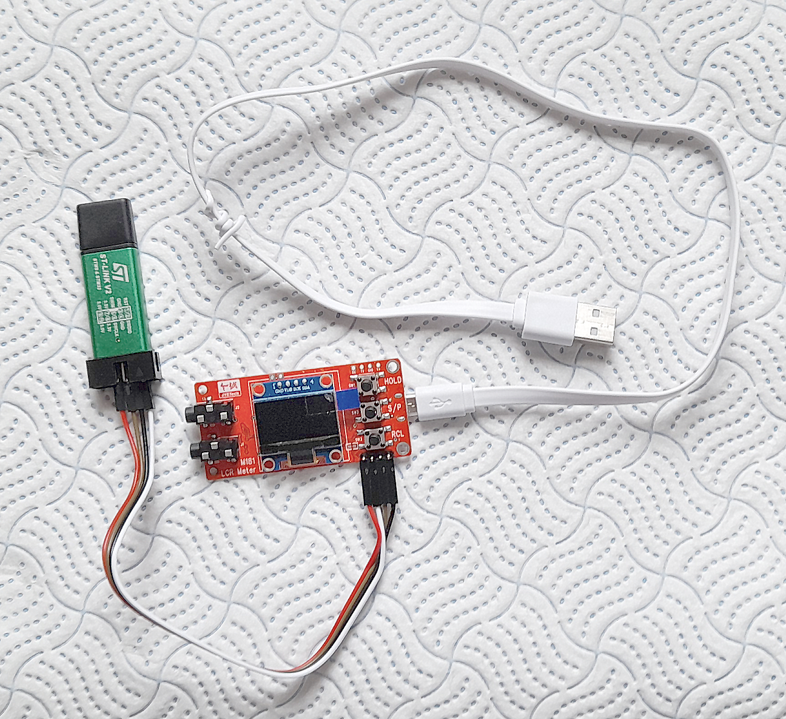
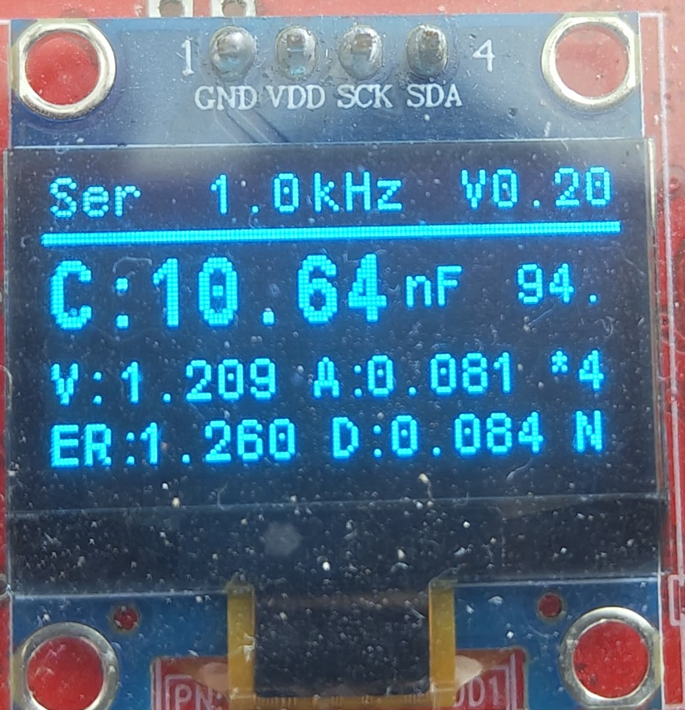

# Goals
   To develop custom firmware for the M181 LCR Meter made by JyeTech.
   Hope to provide understanding in basics of LCR Meter.

# Original firmware source
- Jaishankar M .. https://github.com/Jaishankar872/LCR_Meter_Proto_M181

## Hardware - M181 LCR Meter
- Official product page link [here](https://jyetech.com/m181-lcr-meter/)

**Note**: Firmware still under development.
# Tasks to be completed
- [ ] Auto calibration option
- [ ] Improve the phase difference calculation
- [ ] Correct the current waveform crop issue in auto gain selection.
- [ ] Add option for Parallel calculation ($C_p$,$L_p$)

# System Overview
## RPI MCU programming
- Programmer → Raspberry pi debug probe (**modified)
- Interface  → SWD
- IDE        → PlatformIO
- Framework  → STM32Cube

## STLinkV2 MCU programming
- Programmer → STLink-V2
- Interface  → SWD
- IDE        → PlatformIO
- Framework  → STM32Cube

## Output parameter

* Ser → Calculation mode Series or Parallel
* 1.0kHz → Frequency signal used for measurement
* V0.20 → Firmware Version
* C → Capacitance **Mode Change
* V → RMS Voltage across the DUT
* A → RMS Current flowing via DUT
* ER → Equivalent Series Resistor(ESR)
* D → Dissipation factor (or) Tan Delta

***
 **Further details by Jaishankar M [Wiki page](https://docs.jaidb.in/m181_lcr/Home/)**
