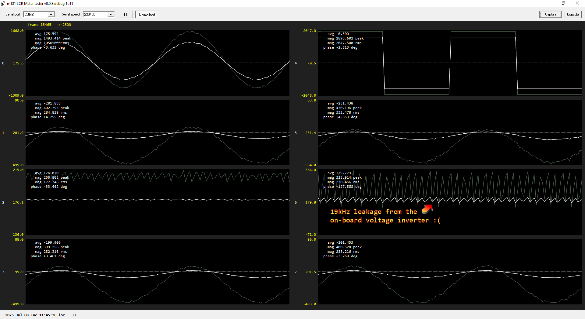
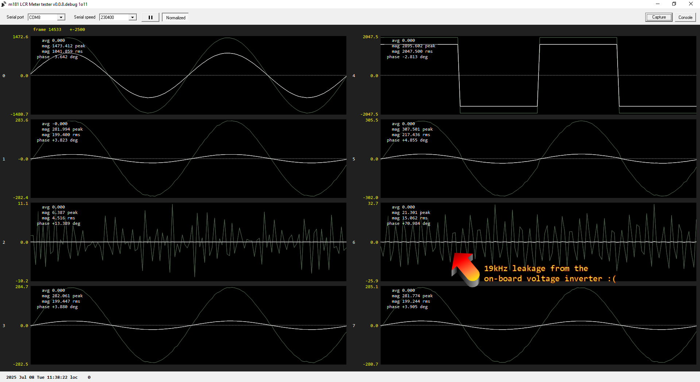
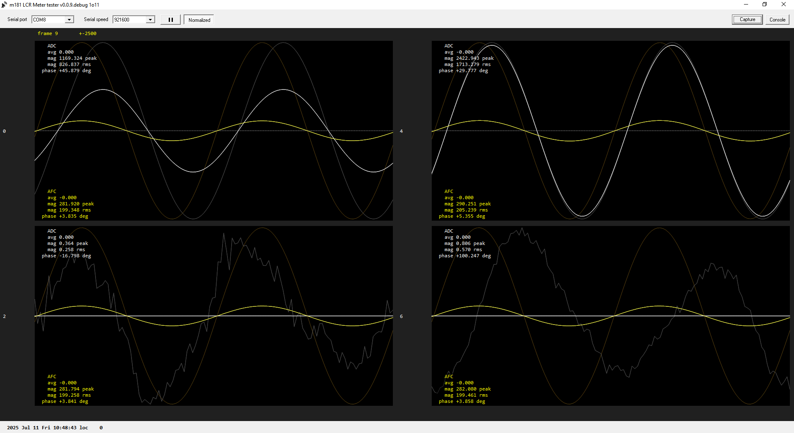
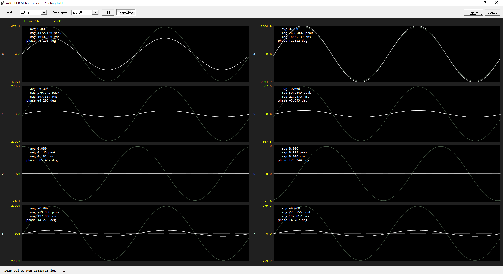
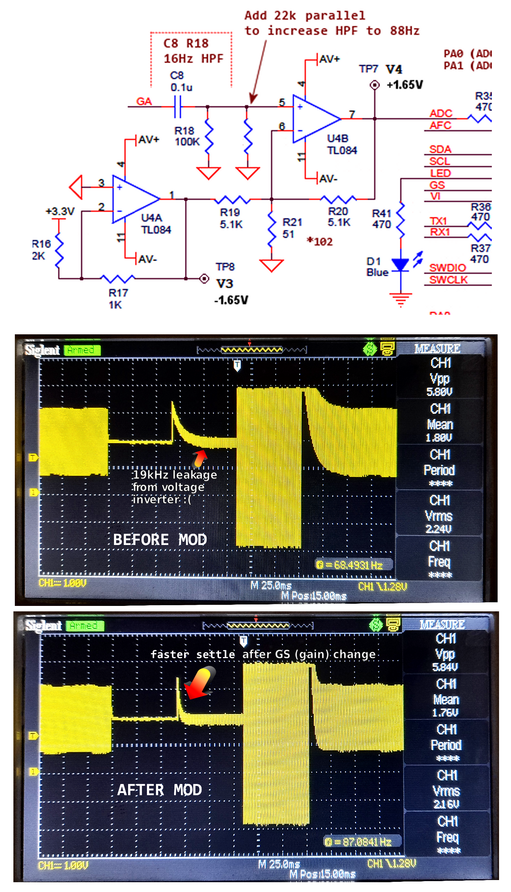
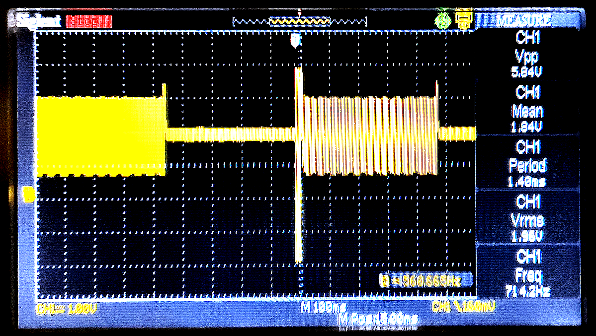
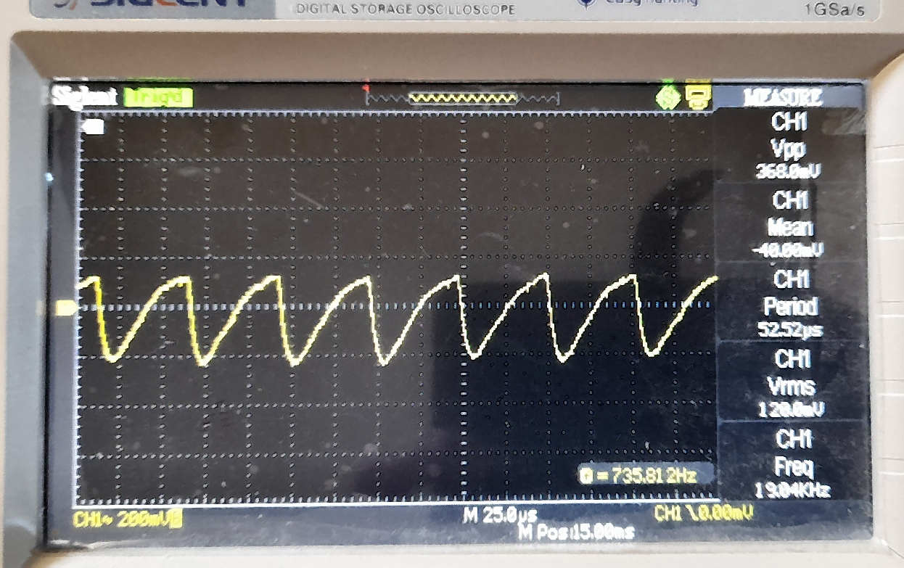
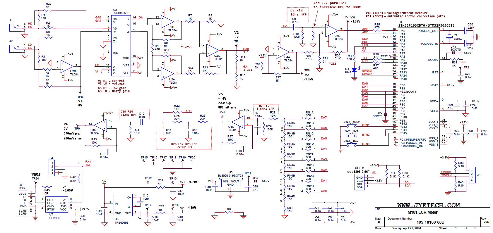

## Goals
   To develop custom firmware for the M181 LCR Meter made by JyeTech.
   Hope to provide understanding in basics of LCR Meter.

## Original firmware source
- Jaishankar M .. https://github.com/Jaishankar872/LCR_Meter_Proto_M181

## Hardware - M181 LCR Meter
- Official product page link [here](https://jyetech.com/m181-lcr-meter/)

**Note**: Firmware still under development.
## Tasks to be completed
- [ ] Auto calibration option
- [ ] Improve the phase difference calculation
- [ ] Correct the current waveform crop issue in auto gain selection.
- [ ] Add option for Parallel calculation ($C_p$,$L_p$)
- [ ] Update a couple of HW component values to add 10kHz option (see LTspice sims)
- [ ] Use a block of flash to save settings/calibrations (emulated EEPROM)

# System Overview ..

## RPI MCU programming
- Programmer → Raspberry pi debug probe (**modified)
- Interface  → SWD
- IDE        → PlatformIO
- Framework  → STM32Cube

## STLinkV2 MCU programming
- Programmer → STLink-V2
- Interface  → SWD
- IDE        → PlatformIO
- Framework  → STM32Cube

## Output parameter

* Ser → Calculation mode Series or Parallel
* 1.0kHz → Frequency signal used for measurement
* V0.20 → Firmware Version
* C → Capacitance **Mode Change
* V → RMS Voltage across the DUT
* A → RMS Current flowing via DUT
* ER → Equivalent Series Resistor(ESR)
* D → Dissipation factor (or) Tan Delta

# Windows test GUI

- streamed uart data from the M181 to the windows test GUI (compiled with Borland c++ builder v6) ..

no Goertzel filter, no block averaging, no DC offset removal ..

no Goertzel filter, with block averaging, with auto DC offset removal ..

with Goertzel 64 sample length filter (1 sine cycle), with block averaging ..

with Goertzel 128 sample length filter (2 sine cycles), with block averaging ..

## HPF modification to improve mode switching time

Waveform as seen on TP4/V4 pin (ADC input pin) ..

Add a 22k resistor across R18.

# Original firmware mode scanning

The auther only scans all modes if need be (makes sense) ..

# PCB bad analog layout design

The level of leakage getting back into the ADC input, it matches the cheaper 20kHz voltage inverter frequency that the seller is fitting to the board :( ..

To reduce this leakage/noise level ..

- add a 100n cap to the ADC input pin
- change R35 to 1k
- add a 10n cap across R20
- add an extra 10uF to -5V line directly next to R32
- change R32 for an inductor - yet to test

# Beware !

The seller (jyetech guy) of these boards is using a fake/counterfeit MCU (STM32F103C8) on this board.

Also, the voltage inverter they are fitting to the board is NOT as stated on their schematic. The device they are fitting is quite different (MUCH lower switching frequency that is causing noise problems).

# Wiki

 **Further details by Jaishankar M [Wiki page](https://docs.jaidb.in/m181_lcr/Home/)**
