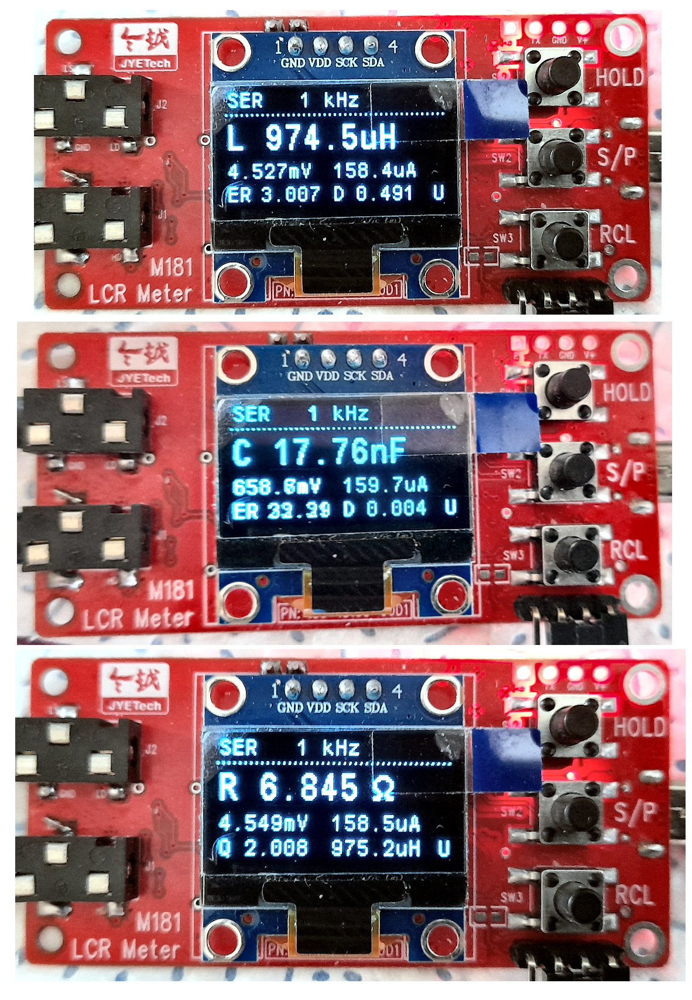
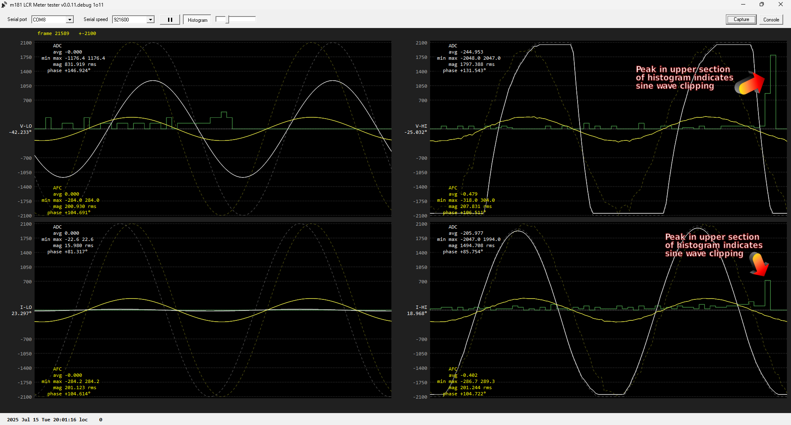
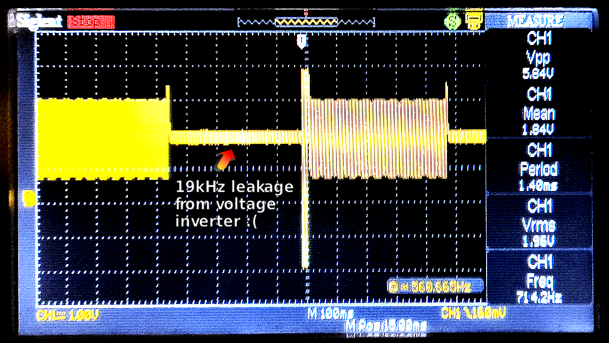
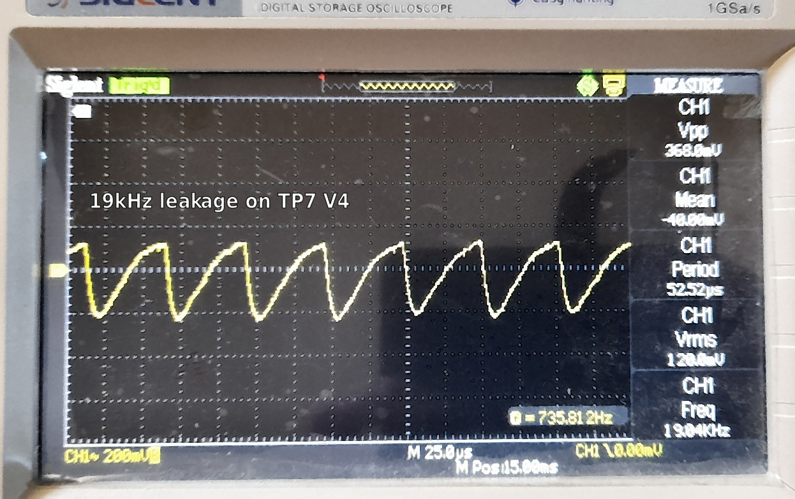
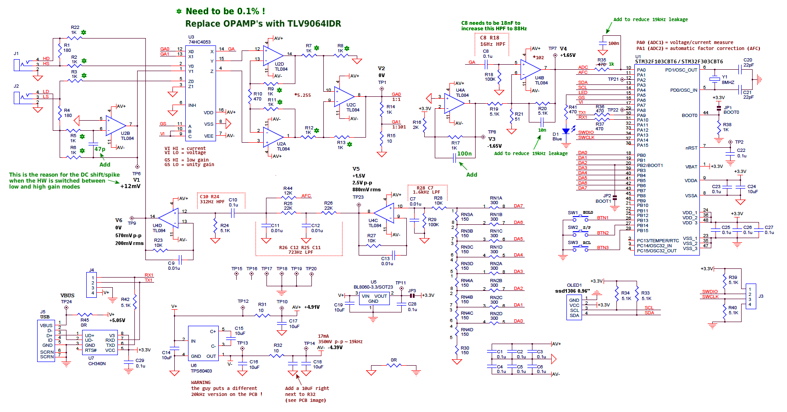

## Goal
   Develop custom firmware for the M181 LCR Meter which is made/sold by 'JyeTech'.

   The makers firmware is somewhat dire (at the time of writing this), it totally ignores any user input (buttons) after about a minute of being powered up.

   Anyway ..

## Original auther of this open source firmware (not the sellers firmware)
- Jaishankar M .. https://github.com/Jaishankar872/LCR_Meter_Proto_M181

## Hardware - M181 LCR Meter
- Official product page link [here](https://jyetech.com/m181-lcr-meter/)

**Note**: Firmware still under development.
## Tasks to be completed
- [ ] Auto calibration option
- [ ] Update a couple of HW component values to add 10kHz option (see LTspice sims)

# System Overview ..

## RPI MCU programming
- Programmer → Raspberry pi debug probe (**modified)
- Interface  → SWD
- IDE        → PlatformIO
- Framework  → STM32Cube

## STLinkV2 MCU programming
- Programmer → STLink-V2
- Interface  → SWD
- IDE        → PlatformIO
- Framework  → STM32Cube

## Output parameter

* Ser → Calculation mode Series or Parallel
* 1.0kHz → Frequency signal used for measurement
* V0.20 → Firmware Version
* C → Capacitance **Mode Change
* V → RMS Voltage across the DUT
* A → RMS Current flowing via DUT
* ER → Equivalent Series Resistor(ESR)
* D → Dissipation factor (or) Tan Delta

# New firmware displays

# Windows test GUI

- streamed uart data from the M181 to the windows test GUI (compiled with Borland c++ builder v6) ..

no Goertzel filter, no block averaging, no DC offset removal ..

no Goertzel filter, with block averaging, with auto DC offset removal ..

with Goertzel 64 sample length filter (1 sine cycle), with block averaging ..

with Goertzel 128 sample length filter (2 sine cycles), with block averaging ..

## How I'm detecting sine wave clipping in HI-gain mode ..

We can simply assume clipping is present if there are any ADC samples near the ADC's min/max (0..4095) range.

The other efficient method is to create a simple histogram of the sample values (per sample block) and look for any spikes in the upper section of the histogram. The histogram method can also very easily detect clipping is occuring in waveforms nowhere near the ADC's maximum range.

## HPF modification to improve mode switching time

Waveform as seen on TP4/V4 pin (ADC input pin) ..

Add a 22k resistor across R18.

# Original firmware mode scanning

The auther only scans all modes if need be (makes sense) ..

# PCB bad analog layout design

The level of leakage getting back into the ADC input, it matches the cheaper 20kHz voltage inverter frequency that the seller is fitting to the board :( ..

To reduce this leakage/noise level ..

- add a 100n cap to the ADC input pin
- change R35 to 1k
- add a 10n cap across R20
- add an extra 10uF to -5V line directly next to R32
- swap R31 and R32 for inductors - yet to do, none currently to hand, need to order some >= 100uH 0805 inductors that will fit the board

# Beware !

The seller (jyetech guy) of these boards is using a fake/counterfeit MCU (STM32F103C8) on this board.

Also, the voltage inverter they are fitting to the board is NOT as stated on the schematic. The device they are fitting is quite different (MUCH lower switching frequency that is causing noise problems).

So if you use the STM32CubeIDE to compile and program the MCU, don't be suprised if it refuses to flash program the MCU - can't blame ST for adding that !

# Wiki

 **Further details by Jaishankar M [Wiki page](https://docs.jaidb.in/m181_lcr/Home/)**
